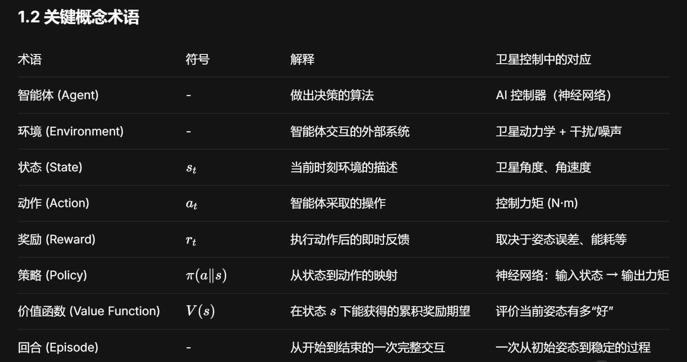
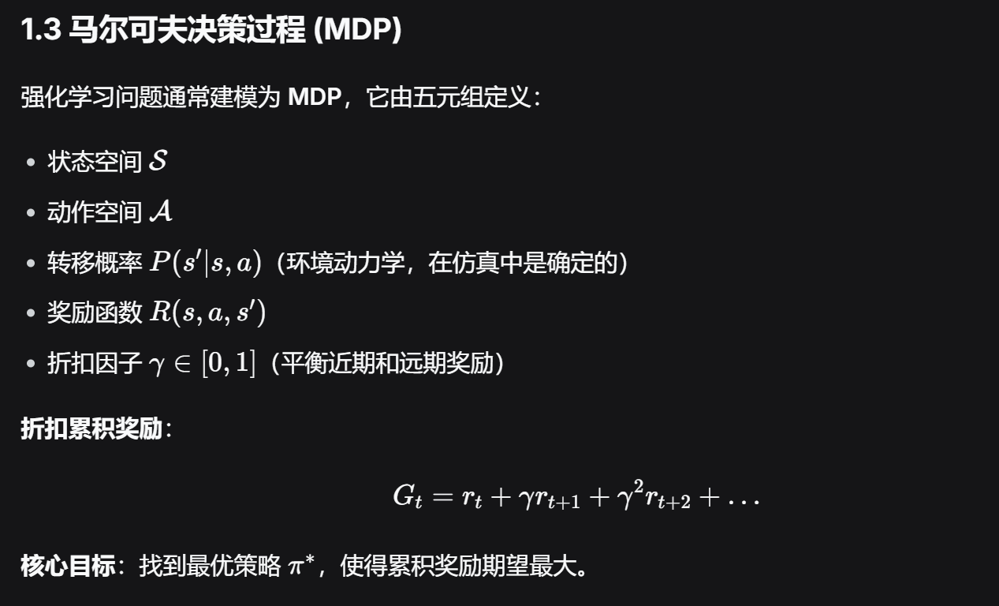
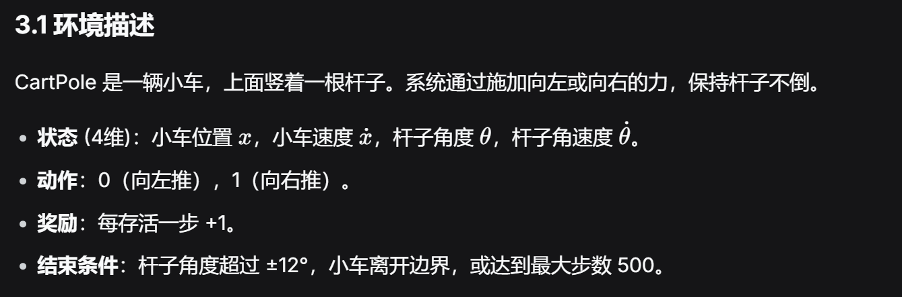
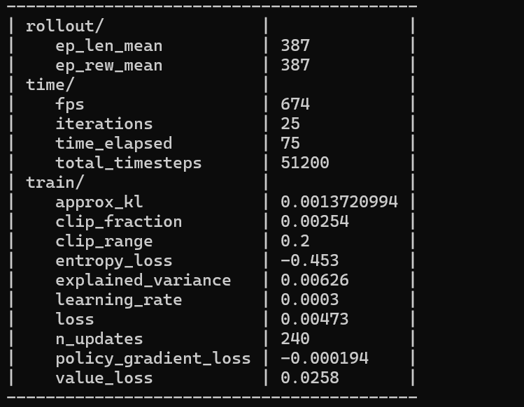
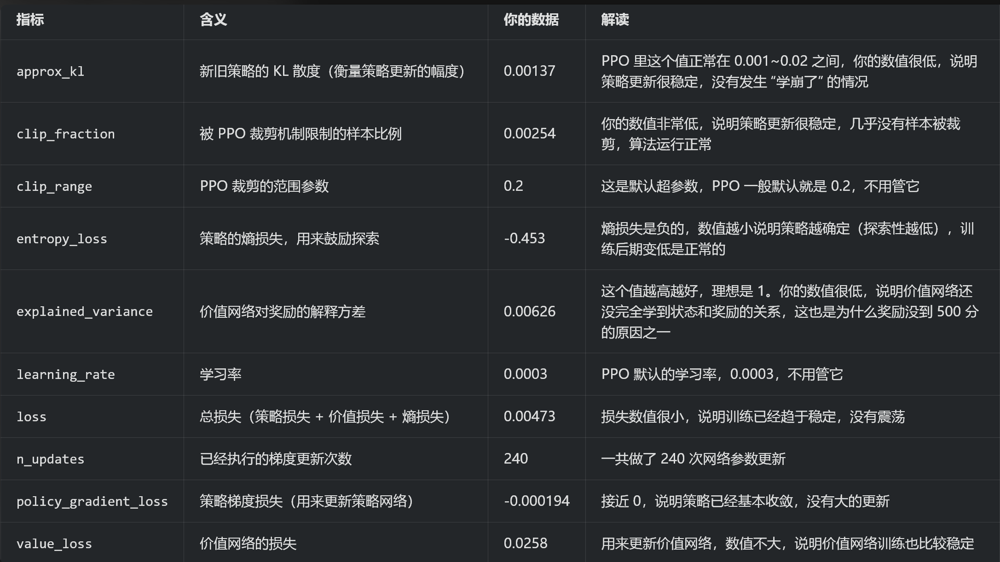

 # 第二阶段第五周详解：强化学习基础
 预览笔记：CTRL+SHIFT+V
 ## 目标：
 从零理解强化学习（Reinforcement Learning, RL）的核心概念，掌握 Gym 环境的使用，为后续自定义卫星环境和训练 AI 控制器打下坚实基础。
 ## 产出：
 能够解释 RL 的基本术语，运行 CartPole 随机策略和 PPO 训练，理解 state、action、reward 的物理意义。
 ## 一、强化学习的核心思想
 ### 1.1 从试错中学习
 ### 1.2 关键概念术语

### 1.3 马尔可夫决策过程 (MDP)


## 二、Gymnasium：强化学习环境标准接口
### API：
API（应用程序编程接口），就是程序之间约定好的「对话规则」。
它规定了：我怎么调用你、给你什么信息、你会返回我什么结果，大家都按这个规则来，就能无缝协作。

### 2.1安装
### 2.2 一个最简单的例子： Blackjack-v1

```python
import gymnasium as gym

# 创建21点纸牌环境
"""
gym.make("环境名") 是 Gymnasium 的核心函数，用于创建指定的环境实例。
"Blackjack-v1" 就是我们要使用的 21 点纸牌游戏环境，它已经内置了完整的游戏规则、状态定义和奖励机制，不用我们自己实现游戏逻辑。
"""
env = gym.make("Blackjack-v1")

# 初始化环境，获取初始状态
"""
env.reset() 会重置游戏到开局状态，返回两个值：
1.obs（观测值 / 状态）：是一个三元组 (玩家点数, 庄家明牌, 是否有可用Ace)，这就是强化学习里的「状态」，代表当前游戏的全部关键信息：
    玩家点数：你手里所有牌的总点数（比如两张牌 10+5=15）
    庄家明牌：庄家亮出的第一张牌的点数（比如庄家亮出了 7）
    是否有可用Ace：布尔值（True/False），表示你手里有没有可以当作 11 点的 Ace（比如你有一张 Ace 和一张 5，既可以算6 点也可以算 16 点，这就是 “可用 Ace”，也叫 “软牌”）

2.info：额外信息字典，在 Blackjack 环境里一般是空的，暂时可以忽略它。
"""
obs, info = env.reset()   # obs = (玩家点数, 庄家明牌, 是否有可用Ace)

print("初始状态:", obs)

# 执行一个随机动作（0: 要牌, 1: 停牌）
"""
这部分是强化学习交互的核心，分两步理解：
（1）选择动作：action = env.action_space.sample()
env.action_space 表示这个环境的「动作空间」，也就是智能体可以执行的所有动作。Blackjack-v1 的动作空间是离散的，只有两个选项：
0：要牌（Hit），再抽一张牌
1：停牌（Stick），不再要牌，等待庄家结算
.sample() 表示从动作空间里随机采样一个动作，也就是随机选 “要牌” 或 “停牌”，这里只是演示交互流程，不是最优策略。
（2）执行动作，接收反馈：env.step(action)
把选好的动作传给环境，环境会执行这个动作，然后返回 5 个关键值：

变量名	含义	Blackjack 场景解释
obs	        新的观测 / 状态	        执行动作后，游戏的新状态（比如你要牌后点数变成了 18）
reward	    奖励信号	            执行这个动作后获得的奖励，规则是：・赢了游戏：+1・输了游戏：-1・平局：0
terminated	游戏是否自然结束	    布尔值，True 表示游戏已经结束（比如你爆牌了、停牌后庄家结算完了）
truncated	游戏是否被环境强制截断	 布尔值，True 表示因为环境限制（比如步数超了）提前结束，Blackjack 里几乎不会出现
info	    额外信息	            这里同样可以忽略
"""
action = env.action_space.sample()

obs, reward, terminated, truncated, info = env.step(action)


print(f"动作: {action}, 新状态: {obs}, 奖励: {reward}, 游戏结束: {terminated}")
```

### 2.3 常用环境属性
每个环境都有：

observation_space：状态空间的结构（如 Box 连续空间，Discrete 离散空间）

action_space：动作空间的结构

reset()：返回初始状态和额外信息

step(action)：执行一步，返回 (next_state新状态, reward奖励, terminated自然终止, truncated强制终止, info额外字典)

```python
"""
1. observation_space：观测（状态）空间的结构
含义：智能体（AI）能 “看到” 的所有可能状态的集合，定义了状态的类型、范围和维度。
常见类型：
类型	                    适用场景	                              例子
Discrete(n)	                离散状态 / 动作，只有 n 个可能的整数值	    21 点里的玩家点数、是否有可用 Ace
Box(low, high, shape)	    连续状态 / 动作，是浮点数，有上下限	        小车立杆里的小车位置、速度
Tuple(space1, space2, ...)	组合空间，把多个不同的空间打包成一个	    21 点的观测就是 3 个离散空间的组合

结合你的 Blackjack-v1 代码：
这个输出完美对应 21 点的三个状态维度：
Discrete(32)：玩家的点数（0~31，共 32 种可能，实际游戏里是 1~31，0 未使用）
Discrete(11)：庄家的明牌点数（0~10，共 11 种可能，实际游戏里是 1~10）
Discrete(2)：是否有可用 Ace（0 = 没有，1 = 有，只有 2 种可能）

2. action_space：动作空间的结构
含义：智能体（AI）可以执行的所有动作的集合，定义了动作的类型、范围和维度。
结合你的 Blackjack-v1 代码：
说明 21 点的动作只有 2 种离散选择：
0：要牌（Hit）
1：停牌（Stick）

3. reset()：重置环境的方法
作用：把游戏 / 任务重置到初始状态，准备开始新的一局。
返回值：(obs, info)
obs：初始观测（开局的状态）
info：额外调试信息（Blackjack 里一般是空字典）
为什么需要它？：强化学习是 “一局一局” 训练的，每局结束后都要调用reset()重置环境，才能开始下一局。

4. step(action)：执行一步交互的核心方法
作用：给环境传入一个动作，让环境执行这个动作，然后返回执行后的反馈。
返回值：(next_state, reward, terminated, truncated, info)
返回值	        含义（你已经学过，这里再快速回顾）
next_state	    执行动作后的新状态
reward	        执行这个动作获得的奖励（21 点里赢 + 1、输 - 1、平 0）
terminated	    游戏是否按规则正常结束（如爆牌、比牌结束）
truncated	    是否被外部条件强制截断（21 点里永远是 False）
info	        额外调试信息（21 点里没用）

"""
print("观测空间:", env.observation_space)   # Tuple(Discrete(32), Discrete(11), Discrete(2))
print("动作空间:", env.action_space)        # Discrete(2)
```
        为什么这些属性对强化学习这么重要？
举个例子：如果你要写一个 Q-learning 算法来训练 21 点 AI，你需要知道：
状态空间有多大？：32 × 11 × 2 = 704 种可能的状态
动作空间有多大？：2 种可能的动作
这样你才能初始化一个 704 × 2 的 Q 表（用来存每个状态下选不同动作的价值）。
而这些信息，都可以通过 env.observation_space 和 env.action_space 直接拿到，不用自己去数游戏规则里的所有可能情况。

### 2.4 交互循环模板
```python
"""
1. 开局初始化：准备好环境和变量
代码	                    作用	                21 点场景解释
state, info = env.reset()	重置环境，开启新一局	返回开局的初始状态：(玩家点数, 庄家明牌, 是否有可用Ace)
done = False	            游戏结束标志位	        初始为False，表示游戏还没结束；循环里只要done=True，就会跳出循环
total_reward = 0	        累计奖励的变量	        用来存这一局所有步骤的奖励总和，最后看总得分（赢 + 1 / 输 - 1 / 平 0）
"""
state, info = env.reset()
done = False
total_reward = 0

"""
2. 核心交互循环：和环境 “玩游戏”
这是强化学习的灵魂，拆成 4 步理解：
① action = policy(state)：根据状态选动作
policy 就是智能体的 “策略”，本质是一个函数：输入当前状态state，输出要执行的动作action。
举几个例子：
随机策略：lambda s: env.action_space.sample()（随便选要牌 / 停牌，就是你之前写的）
固定策略：比如 21 点里 “点数＜17 就一直要牌，≥17 就停牌” 的规则
训练好的策略：比如用 Q-learning 学出来的最优策略
强化学习的目标，就是优化这个policy，让它选出来的动作能拿到最多的总奖励。

② env.step(action)：执行动作，拿环境反馈
把选好的动作传给环境，环境执行后返回 5 个关键值：

③ total_reward += reward：累计奖励
把每一步拿到的奖励加起来，一局结束后，total_reward就是这一局的总得分，用来评价智能体玩得好不好。

④ done = terminated or truncated：判断游戏是否结束
这里是新手容易忽略的细节：只要terminated（正常结束）或者truncated（强制截断）有一个为 True，就说明这一局已经结束，需要跳出循环。

为什么要同时判断两个？有些环境（比如机器人走路）会设置步数上限，即使没出结果，到了步数也要强制结束，这时候truncated=True，也要跳出循环。
对你的 21 点来说，truncated永远是 False，所以done其实就等于terminated，但写or是通用写法，换其他环境也能用。
"""
while not done:
    action = policy(state)          # 根据当前状态选择动作
    state, reward, terminated, truncated, info = env.step(action)
    total_reward += reward
    done = terminated or truncated

"""
3. 收尾：输出结果
循环结束后，打印这一局的总奖励，就能知道智能体这一局是赢了、输了还是平局。
"""
print(f"总奖励: {total_reward}")
```

## 三、经典入门环境：CartPole-v1
### 3.1 环境描述
CartPole 是一辆小车，上面竖着一根杆子。系统通过施加向左或向右的力，保持杆子不倒。



### 3.2 随机策略测试

```python
import gymnasium as gym

"""
创建带可视化的小车立杆环境
CartPole-v1：Gymnasium 内置的经典强化学习环境，目标是通过左右推小车，让杆子保持竖直不倒下。
render_mode="human"：关键参数！表示以「人类可见」的模式渲染环境，运行时会弹出一个窗口，实时显示小车和杆子的动画。如果不加这个参数，默认是render_mode=None，只会后台运行，看不到画面。
"""
env = gym.make("CartPole-v1", render_mode="human")  # 显示窗口

"""
初始化环境
重置环境，把小车和杆子恢复到初始状态（小车在中间，杆子竖直）。
返回的obs是初始状态（小车位置、小车速度、杆子角度、杆子角速度），info是额外信息，这里可以忽略。
"""
obs, info = env.reset()

"""
主循环：执行 1000 步随机动作
这是代码的核心，分三步理解：
① action = env.action_space.sample()：随机选动作
CartPole-v1的动作空间是Discrete(2)，只有两个动作：
0：向左推小车
1：向右推小车
.sample()表示从动作空间里随机采样，也就是随便选左或右，完全没有策略。

② env.step(action)：执行动作，拿反馈
把选好的动作传给环境，环境执行后返回 5 个值

③ if terminated or truncated: env.reset()：游戏结束就重置
只要杆子倒下（terminated=True）或者步数到上限（truncated=True），就调用env.reset()重置环境，开始下一局。
这样循环 1000 步里，会自动重复玩多局，每局倒下就重来。
"""
for _ in range(1000):
    action = env.action_space.sample()   # 随机动作
    obs, reward, terminated, truncated, info = env.step(action)
    if terminated or truncated:
        obs, info = env.reset()

env.close()
```

你会看到小车随机推杆，很快倒下。

###  3.3 使用 Stable-Baselines3 训练 PPO
为了让杆子长时间不倒，我们需要一个智能策略。使用开箱即用的 PPO 算法。

#### 先安装 SB3：
```python
pip install stable-baselines3
```

#### 训练脚本：

```python
import gymnasium as gym

"""
stable_baselines3 是强化学习的第三方库，封装了 PPO、DQN、A2C 等主流算法，不用自己手写复杂的训练逻辑。
PPO 是一种常用的强化学习算法（Proximal Policy Optimization，近端策略优化），以稳定、易调参著称，是新手入门的首选算法之一。
"""
from stable_baselines3 import PPO

"""
创建训练环境
和之前一样，创建小车立杆环境。
注意这里没有加 render_mode="human"，是因为训练时不需要可视化，后台运行会更快，训练效率更高。
"""
env = gym.make("CartPole-v1")

"""
初始化 PPO 模型
PPO()：创建一个 PPO 智能体实例。
"MlpPolicy"：指定策略网络的类型，MlpPolicy 表示用 ** 多层感知机（MLP，也就是普通的全连接神经网络）** 来表示策略，适用于像 CartPole 这样的低维连续状态空间。
env：绑定要训练的环境。
verbose=1：训练过程中打印日志（比如进度条、奖励变化），方便你看训练情况。
"""
model = PPO("MlpPolicy", env, verbose=1)

"""
开始训练
model.learn()：SB3 封装好的训练函数，会自动和环境交互、更新策略。
total_timesteps=50000：总共和环境交互 50000 步，步数越多，训练时间越长，模型也越可能学到最优策略。
对于 CartPole 这种简单环境，50000 步基本足够训练出能拿满分的智能体了。
"""
model.learn(total_timesteps=50000)

"""
保存训练好的模型
把训练好的模型参数保存到文件 ppo_cartpole.zip 里，之后可以直接加载使用，不用重复训练。
"""
model.save("ppo_cartpole")

# 测试训练好的模型
"""
创建带可视化的测试环境
这次加了 render_mode="human"，运行时会弹出窗口，实时显示小车和杆子的动画，让你直观看到智能体的表现。
"""
env = gym.make("CartPole-v1", render_mode="human")

#重置环境,把环境重置到初始状态，准备开始测试。
obs, info = env.reset()

#主循环：用训练好的模型玩游戏
"""
核心逻辑和你之前写的随机策略循环几乎一样，只是选动作的方式变了：
① model.predict(obs, deterministic=True)：用训练好的模型选动作
model.predict()：SB3 封装好的动作预测函数，输入当前状态 obs，输出智能体选的动作。
deterministic=True：表示用确定性策略选动作，每次都会选当前状态下模型认为最优的那个动作，而不是带随机性的探索动作，这样测试效果更稳定。
返回值：action 是选好的动作（0 或 1），_states 是 LSTM 等循环网络的隐藏状态，这里用的是 MLP，所以可以忽略它。

② env.step(action)：执行动作，拿反馈
和之前一样，环境执行动作，返回新状态、奖励、结束标志等。

③ if terminated or truncated: env.reset()：游戏结束就重置
杆子倒下或步数到上限（500 步）时，重置环境，开始下一局，一直循环 1000 步。
"""
for _ in range(1000):
    action, _states = model.predict(obs, deterministic=True)
    obs, reward, terminated, truncated, info = env.step(action)
    if terminated or truncated:
        obs, info = env.reset()
env.close()
```

你会看到小车能长时间平衡杆子。这说明强化学习算法有效。

#### 解析每次的训练数据
以最后一次训练所得的数据为例

这些指标分成三类：
一、rollout/：和环境交互的表现指标（最关键！）
这部分是智能体在环境里玩游戏的实际表现，直接反映训练效果。
指标	    含义	                  你的数据	   解读
ep_len_mean	平均每局的步数（回合长度）	387	        小车平均每局能撑 387 步
ep_rew_mean	平均每局的奖励（回合奖励）	387	        CartPole 每步 + 1 分，所以和步数数值一样，说明平均每局拿 387 分

解读：
CartPole 的满分是 500 分（撑住 500 步），你的 387 分已经比随机策略（平均 20 分）强很多了，但还没到完全收敛的水平。
继续训练的话，这两个值会慢慢涨到 500，就说明模型已经学会了完美平衡杆子。

二、time/：训练的时间和效率指标
这部分是训练过程的统计数据，用来评估训练速度。

指标	含义	               你的数据	    解读
fps	    每秒处理的环境交互步数	674	        每秒跑 674 步，对于 CartPole 来说，这个速度非常快，说明你的电脑性能不错
iterations	已经完成的训练迭代次数	25	已经跑了 25 轮 PPO 迭代
time_elapsed	已经过去的训练时间（秒）	75	训练一共花了 75 秒，也就是 1 分 15 秒
total_timesteps	累计和环境交互的总步数	51200	已经跑了 51200 步，接近你设置的 50000 步上限

三、train/：PPO 算法的内部训练指标（用来判断训练是否正常）
这部分是算法的内部状态，用来判断训练过程有没有出问题，不用每个都抠细节，看趋势就行。


#### 「步数、回合、迭代、轮数」几个概念
术语	英文	    一句话定义	                          你的 CartPole 例子
步数	timestep	智能体和环境交互的一次动作（走一步）	小车推一下杆子，算 1 步
回合	episode	    一局完整游戏，从开局到结束	           杆子倒下或撑满 500 步，一局结束
迭代	iteration	算法用一批数据更新一次策略（PPO 特有）	收集一批数据 → 做一次梯度更新
轮数	epoch	    把一批数据完整过一遍（深度学习通用）	把同一批数据再学一遍

## 四、从 CartPole 到卫星控制的思考
要素	CartPole	                        卫星姿态控制
状态	4 维连续（位置、速度、角度、角速度）	2 维连续（角度、角速度）
动作	2 个离散（左/右）	                  连续力矩（-2 ~ 2 N·m）
奖励	每步 +1	                             负的加权平方和（希望误差小、省力）
目标	保持杆子直立	                      卫星指向目标角度

重要启发：
卫星控制是 连续动作空间，需要像 PPO、DDPG、SAC 这类算法。
奖励函数的设计直接影响学习效果。CartPole 奖励简单（+1 per step），卫星则需要精心设计（通常为负的误差函数）。