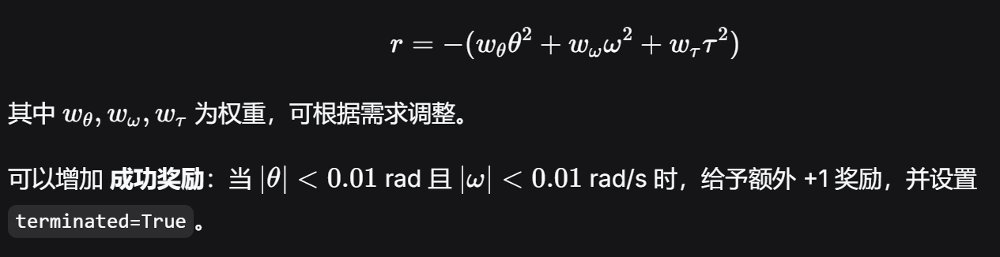

# 第二阶段第六周详解：创建卫星Gym环境
目标：将第一阶段的单轴卫星姿态仿真（或扩展的三轴模型）封装成符合 Gymnasium 标准的自定义环境，为后续训练强化学习智能体做好准备。
时间：7天。
产出：可运行的 SatelliteEnv 类，支持 reset()、step()、render()，能够与 Stable-Baselines3 等库交互。

## 一、为什么要封装成 Gym 环境？
### 强化学习框架（如 Stable-Baselines3）要求环境遵循统一的接口：
reset() → 返回初始观测
step(action) → 返回 (next_obs, reward, terminated, truncated, info)

### 封装的好处：
可以直接使用现成的算法（PPO、SAC、DDPG 等）。
方便进行超参数搜索、并行训练、回调评估。
代码结构清晰，便于后续改为三轴或添加新特性。

## 二、Gymnasium 环境核心要素
### 一个自定义环境必须继承 gym.Env 并实现以下方法：

方法	                            作用
__init__()	                    定义观测空间 observation_space 和动作空间 action_space，初始化物理参数。
reset(seed=None, options=None)	重置环境到随机初始状态，返回初始观测和 info 字典。
step(action)	                执行一步动力学更新，计算奖励，判断是否结束，返回 (obs, reward, terminated, truncated, info)。
render()	                    （可选）可视化当前状态。
### 重要概念：
terminated：环境因达成目标或失败而结束（如卫星已稳定）。
truncated：环境因时间步达到上限而强制结束（与任务成功/失败无关）。

两者分开可以区分“成功/失败”与“超时”。

## 三、设计卫星环境的状态与动作

### 3.1 状态空间（单轴）
我们希望 AI 能观测到：当前角度 θ (rad),当前角速度 ω (rad/s)
因此观测空间为 2 维连续空间，每个维度有界（例如角度 ±π，角速度 ±5 rad/s）。

```python
"""
这段代码定义了一个2 维的连续观测空间，用的是 Gymnasium 的spaces.Box类型，专门用来描述「状态是连续浮点数」的场景（比如机器人角度、速度、小车位置等）。

1. 核心定义：self.observation_space = spaces.Box(...)
self.observation_space：是 Gymnasium 环境必须实现的标准属性，作用是告诉强化学习算法：智能体能观测到的状态是什么样的（维度、每个维度的取值范围、数据类型）。
spaces.Box：Gymnasium 中代表「连续空间」的类，适用于状态 / 动作是连续浮点数的场景，比如角度、速度、力等。和你之前学的Discrete（离散空间）正好对应。

2. low=np.array([-np.pi, -5.0], dtype=np.float32)
low参数：定义观测空间每个维度的最小值。
这里是一个长度为 2 的数组，说明观测空间是2 维的：
第 1 个维度的最小值：-np.pi（约 - 3.1416，弧度制，对应角度 - 180°）
第 2 个维度的最小值：-5.0
dtype=np.float32：指定数组的数据类型为 32 位浮点数，减少计算量，和后面的类型参数保持一致。

3. high=np.array([np.pi, 5.0], dtype=np.float32)
high参数：定义观测空间每个维度的最大值。
对应 2 个维度的最大值：
第 1 个维度的最大值：np.pi（约 3.1416，对应角度 180°）
第 2 个维度的最大值：5.0

4. dtype=np.float32
整个 Box 空间的数据类型，指定观测值的类型是 32 位浮点数，和low、high的类型匹配，避免数据类型不匹配的错误。
"""
self.observation_space = spaces.Box(
    low=np.array([-np.pi, -5.0], dtype=np.float32),
    high=np.array([np.pi, 5.0], dtype=np.float32),
    dtype=np.float32
)
```

### 3.2 动作空间
控制力矩 τ 连续，范围例如[−2,2] N·m，因此动作空间为 1 维连续空间。

```python
self.action_space = spaces.Box(
    low=-2.0, high=2.0, shape=(1,), dtype=np.float32
)
```

### 3.3 奖励函数设计（核心）
奖励函数指导智能体学习。常用设计原则：
密集奖励：每一步给予负的误差惩罚，鼓励快速减小误差。
稀疏奖励：只有成功稳定时给予正奖励，学习困难但有时更优。
工程折中：结合角度误差、角速度、控制能耗。

我们采用 负的加权平方和 形式：


## 四、实现单轴卫星环境（完整代码）
我们建立如下文件：
1.satellite_env.py
2.复用week单轴卫星模型satellite.py
3.test_env.py(测试环境)