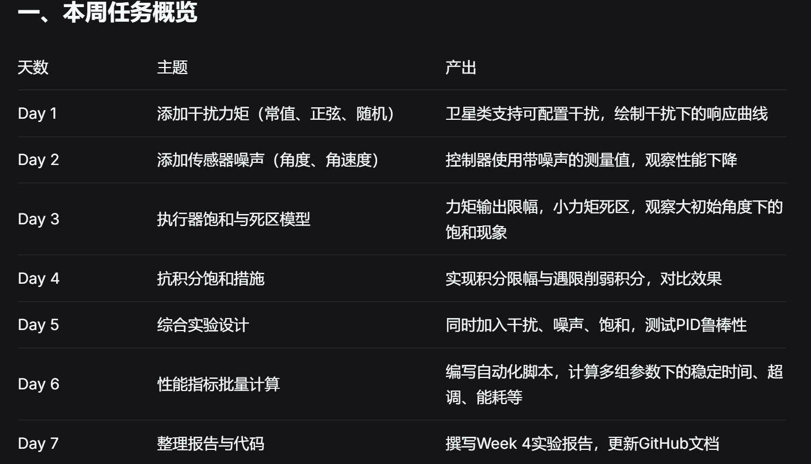
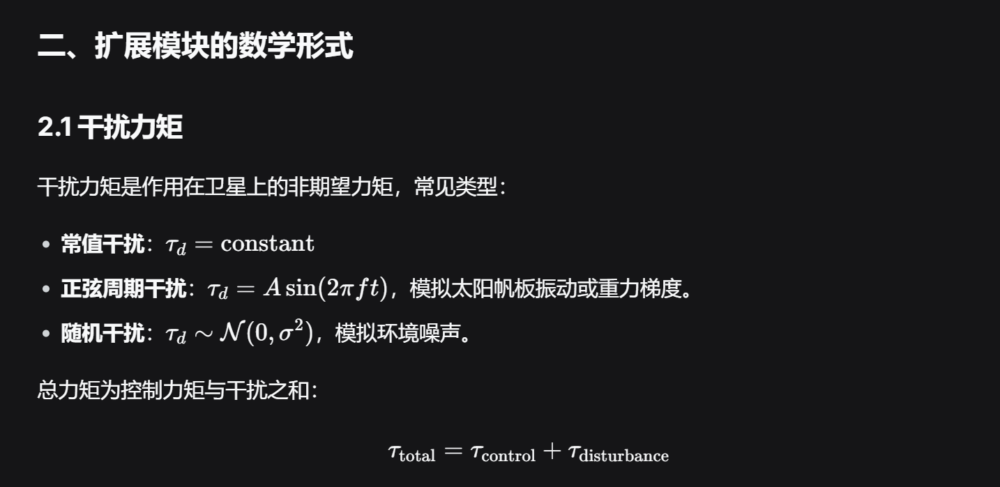
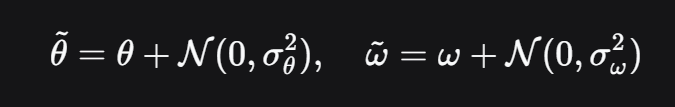
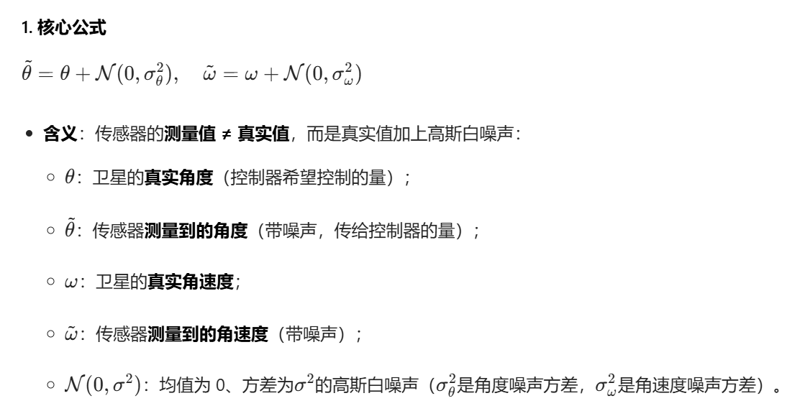
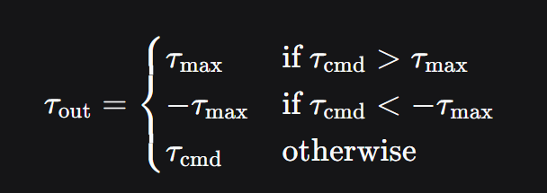
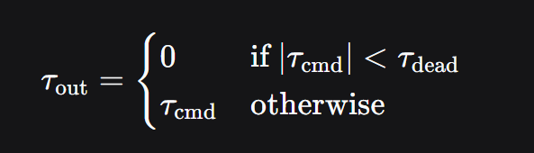

本文件为markdown文件，按 Ctrl+Shift+V 打开 Markdown 预览，可以直接看图哟
# 一、本周目标：
在前三周搭建的单轴PID仿真系统基础上，增加干扰力矩、传感器噪声、执行器饱和/死区、抗积分饱和等真实物理特性，使仿真更接近实际卫星。并通过批量实验，系统分析PID控制器在不同条件下的性能。

# 二、扩展模块的数学形式

## 2.1 干扰力矩

总力矩是控制力矩和干扰力矩之和，也就是说每次的控制力矩虽然算的时候是理想的，但作用的时候却不能理想地作用

## 2.2 传感器噪声
传感器测量值 = 真实值 + 高斯白噪声：

注意：微分项对噪声敏感，过大的噪声会导致力矩剧烈抖动。

微分项对噪声敏感，过大的噪声会导致力矩剧烈抖动。
为什么？：PID 控制器的微分项（D）是对误差求导，而噪声是高频信号，微分操作会放大高频噪声，导致控制器输出的τ control剧烈波动（也就是 “力矩抖动”）。

### 注：多次出现了高斯分布/正态分布
「正态分布」：统计学里的通用叫法
这个分布是自然界中最常见的概率分布（比如身高、测量误差、噪声），早期统计学家发现大量随机现象都符合这个分布，就把它叫做「正态分布」（Normal Distribution，“Normal” 有 “正常、常见” 的意思）。
符号表示：用大写字母 N表示，比如笔记里的 N(0,σ2)，这里的 N就是 Normal 的缩写。

代码里的 np.random.normal()，函数名里的 normal 就是 “正态 / 高斯” 的意思，生成的就是高斯分布的随机数。

## 2.3 执行器饱和与死区
饱和：执行器能够输出的最大力矩 τmax，实际输出被裁剪：

死区：小力矩无法驱动执行器（如摩擦力），低于阈值则输出0：

## 2.4 抗积分饱和
当输出饱和时，积分项可能继续增大（积分饱和），导致控制器退出饱和后响应迟钝。常用方法：
积分限幅：限制积分累加器的最大值，如∣I∣≤Imax。

遇限削弱积分：当输出达到饱和且误差符号与积分趋势一致时，停止积分累加。
